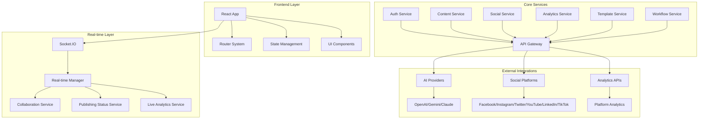
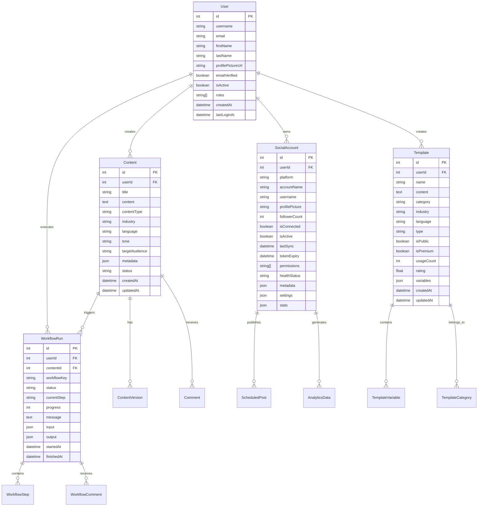

# System Design & Architecture

## Architecture Overview
**What is the high-level system structure?**

The AI Content Automation Platform is a modern React-based Single Page Application (SPA) built with TypeScript, featuring a comprehensive content creation, management, and publishing ecosystem.



### Key Components and Responsibilities

- **Frontend Application**: React 18 SPA with TypeScript, Material-UI components
- **Authentication System**: JWT-based auth with role-based access control
- **Content Management**: AI-powered content generation, editing, and version control
- **Social Media Integration**: Multi-platform publishing and scheduling
- **Analytics Engine**: Performance tracking and ROI calculation
- **Template System**: Reusable content templates with variable substitution
- **Workflow Engine**: Automated content processing pipelines
- **Real-time Collaboration**: Live editing with presence indicators

### Technology Stack Choices and Rationale

- **React 18**: Modern concurrent features, hooks, and performance optimizations
- **TypeScript**: Type safety, better developer experience, and maintainability
- **Material-UI**: Comprehensive component library with accessibility built-in
- **React Router v6**: Advanced routing with lazy loading and code splitting
- **Socket.IO**: Real-time communication for collaboration features
- **TanStack Query**: Server state management and caching
- **Vite**: Fast build tool and development server

## Data Models
**What data do we need to manage?**

### Core Entities



### Data Flow Between Components

1. **Authentication Flow**: User login → JWT token → API requests → User context
2. **Content Creation**: User input → AI processing → Content storage → Version control
3. **Social Publishing**: Content → Platform-specific formatting → Scheduled publishing
4. **Analytics Collection**: Platform APIs → Data aggregation → Performance metrics
5. **Real-time Updates**: WebSocket connections → Live collaboration → UI updates

## API Design
**How do components communicate?**

### External APIs

#### Authentication Endpoints
```
POST /auth/login
POST /auth/register
POST /auth/logout
GET  /auth/me
POST /auth/refresh
```

#### Content Management
```
GET    /api/content
POST   /api/content
GET    /api/content/:id
PUT    /api/content/:id
DELETE /api/content/:id
POST   /api/content/:id/versions
GET    /api/content/:id/versions
```

#### Social Media Integration
```
GET    /api/social/accounts
POST   /api/social/accounts/connect
DELETE /api/social/accounts/:id
POST   /api/social/posts/schedule
GET    /api/social/posts/queue
GET    /api/social/analytics/:accountId
```

#### Template System
```
GET    /api/templates
POST   /api/templates
GET    /api/templates/:id
PUT    /api/templates/:id
DELETE /api/templates/:id
POST   /api/templates/:id/process
```

#### Workflow Engine
```
POST   /api/workflows/trigger
GET    /api/workflows/runs/:id
GET    /api/workflows/runs/:id/status
POST   /api/workflows/runs/:id/comments
```

### Internal Interfaces

#### Service Layer Architecture
```typescript
interface BaseApiService {
  get<T>(endpoint: string, loadingKey?: string): Promise<ServiceResponse<T>>
  post<T>(endpoint: string, data: any, loadingKey?: string): Promise<ServiceResponse<T>>
  put<T>(endpoint: string, data: any, loadingKey?: string): Promise<ServiceResponse<T>>
  delete<T>(endpoint: string, loadingKey?: string): Promise<ServiceResponse<T>>
}

interface ServiceResponse<T> {
  data: T
  errorCode: string
  errorMessage?: string
  success: boolean
}
```

#### Real-time Communication
```typescript
interface SocketService {
  connect(options: ConnectionOptions): Promise<void>
  disconnect(): void
  joinRoom(roomId: string): void
  leaveRoom(roomId: string): void
  emit(event: string, data: any): void
  on(event: string, callback: Function): void
}
```

### Request/Response Formats

All API responses follow a standardized format:
```typescript
interface ResponseBase<T> {
  errorCode: 'SUCCESS' | 'ERROR' | 'VALIDATION_ERROR' | 'AUTHENTICATION_ERROR'
  errorMessage?: string
  data: T
  timestamp: string
  requestId: string
}
```

### Authentication/Authorization Approach

- **JWT Tokens**: Stateless authentication with refresh token rotation
- **Role-Based Access Control**: User roles determine feature access
- **OAuth Integration**: Social platform authentication via OAuth 2.0
- **Token Management**: Automatic token refresh and secure storage

## Component Breakdown
**What are the major building blocks?**

### Frontend Components

#### Core Application Structure
- **App.tsx**: Main application entry point with providers and routing
- **Router System**: Lazy-loaded routes with protected route guards
- **Layout Components**: Common layout patterns and navigation

#### Feature Modules
- **Authentication**: Login, registration, password management
- **Content Management**: Creation, editing, version control, export
- **Social Media**: Account management, publishing, scheduling, analytics
- **Templates**: Template library, editor, variable system
- **Workflow**: Workflow execution, monitoring, collaboration
- **Analytics**: Performance dashboards, reporting, ROI calculation

#### Shared Components
- **UI Components**: Material-UI based component library
- **Form Components**: Validation, error handling, accessibility
- **Data Display**: Tables, charts, cards, lists
- **Navigation**: Sidebar, breadcrumbs, pagination
- **Feedback**: Toasts, notifications, loading states

### Backend Services (API Layer)

#### Service Architecture
- **AuthService**: User authentication and authorization
- **ContentService**: Content CRUD operations and AI integration
- **SocialService**: Social media platform integration
- **TemplateService**: Template management and processing
- **WorkflowService**: Workflow execution and monitoring
- **AnalyticsService**: Data aggregation and reporting

#### Real-time Services
- **SocketService**: WebSocket connection management
- **CollaborationService**: Real-time editing and presence
- **PublishingStatusService**: Live publishing updates
- **LiveAnalyticsService**: Real-time analytics streaming

### Database/Storage Layer

#### Data Persistence
- **User Data**: Profiles, preferences, authentication tokens
- **Content Storage**: Content versions, metadata, relationships
- **Social Accounts**: Platform connections, settings, statistics
- **Templates**: Template definitions, variables, usage data
- **Workflow Data**: Execution history, step results, comments
- **Analytics Data**: Performance metrics, aggregated statistics

### Third-party Integrations

#### AI Providers
- **OpenAI**: GPT models for content generation
- **Google Gemini**: Alternative AI content generation
- **Anthropic Claude**: Advanced content processing

#### Social Media Platforms
- **Facebook**: Pages, Groups, Stories, Events
- **Instagram**: Posts, Stories, Reels, IGTV
- **Twitter**: Tweets, Threads, Spaces
- **YouTube**: Videos, Shorts, Community posts
- **LinkedIn**: Posts, Articles, Professional content
- **TikTok**: Video content, trending hashtags

#### Analytics Providers
- **Platform APIs**: Native analytics from social platforms
- **Third-party Analytics**: Google Analytics, Facebook Analytics
- **Custom Metrics**: ROI calculation, engagement tracking

## Design Decisions
**Why did we choose this approach?**

### Key Architectural Decisions

#### 1. Single Page Application (SPA)
- **Rationale**: Better user experience, faster navigation, offline capabilities
- **Trade-offs**: Initial load time vs. runtime performance
- **Implementation**: React Router with lazy loading and code splitting

#### 2. Component-Based Architecture
- **Rationale**: Reusability, maintainability, testability
- **Patterns**: Atomic design principles, compound components
- **Benefits**: Consistent UI, easier maintenance, better developer experience

#### 3. Real-time Collaboration
- **Rationale**: Modern content creation requires team collaboration
- **Technology**: Socket.IO for WebSocket communication
- **Features**: Live editing, presence indicators, conflict resolution

#### 4. Multi-Provider AI Integration
- **Rationale**: Flexibility, redundancy, best-of-breed solutions
- **Implementation**: Abstracted AI service layer with provider switching
- **Benefits**: Vendor independence, performance optimization

#### 5. Progressive Web App (PWA)
- **Rationale**: Mobile-first approach, offline capabilities
- **Features**: Service workers, push notifications, app-like experience
- **Benefits**: Better mobile UX, reduced app store dependencies

### Alternatives Considered

#### State Management
- **Chosen**: React Context + TanStack Query
- **Alternatives**: Redux, Zustand, Jotai
- **Reason**: Simpler for this use case, better TypeScript integration

#### UI Framework
- **Chosen**: Material-UI
- **Alternatives**: Chakra UI, Ant Design, Headless UI
- **Reason**: Comprehensive component library, accessibility built-in

#### Build Tool
- **Chosen**: Vite
- **Alternatives**: Webpack, Parcel, esbuild
- **Reason**: Faster development, better TypeScript support

### Patterns and Principles Applied

#### SOLID Principles
- **Single Responsibility**: Each service handles one domain
- **Open/Closed**: Extensible through interfaces and plugins
- **Liskov Substitution**: Interchangeable AI providers
- **Interface Segregation**: Focused service interfaces
- **Dependency Inversion**: Abstracted dependencies

#### Design Patterns
- **Factory Pattern**: Service creation and AI provider selection
- **Observer Pattern**: Real-time updates and event handling
- **Strategy Pattern**: Different AI providers and social platforms
- **Template Method**: Workflow execution steps
- **Facade Pattern**: Simplified API interfaces

## Non-Functional Requirements
**How should the system perform?**

### Performance Targets

#### Frontend Performance
- **Initial Load**: < 3 seconds on 3G connection
- **Route Navigation**: < 500ms for cached routes
- **Component Rendering**: < 100ms for complex components
- **Bundle Size**: < 1MB initial bundle, < 200KB per route

#### API Performance
- **Response Time**: < 200ms for simple operations, < 2s for complex operations
- **Throughput**: Support 1000+ concurrent users
- **Caching**: 95% cache hit rate for static content

#### Real-time Performance
- **Latency**: < 50ms for real-time updates
- **Connection Stability**: 99.9% uptime for WebSocket connections
- **Scalability**: Support 10,000+ concurrent connections

### Scalability Considerations

#### Horizontal Scaling
- **Load Balancing**: Multiple API server instances
- **Database Sharding**: User-based data partitioning
- **CDN Integration**: Static asset distribution
- **Microservices**: Service decomposition for independent scaling

#### Vertical Scaling
- **Resource Optimization**: Memory and CPU usage monitoring
- **Database Optimization**: Query optimization and indexing
- **Caching Strategy**: Multi-level caching (browser, CDN, application)

### Security Requirements

#### Authentication & Authorization
- **JWT Security**: Secure token storage and rotation
- **OAuth Integration**: Secure social platform connections
- **Role-Based Access**: Granular permission system
- **Session Management**: Secure session handling

#### Data Protection
- **Encryption**: Data encryption in transit and at rest
- **Input Validation**: Comprehensive input sanitization
- **XSS Protection**: Content Security Policy implementation
- **CSRF Protection**: Cross-site request forgery prevention

#### Privacy Compliance
- **GDPR Compliance**: Data privacy and user rights
- **Data Minimization**: Collect only necessary data
- **User Consent**: Clear consent mechanisms
- **Data Retention**: Automated data cleanup policies

### Reliability/Availability Needs

#### System Reliability
- **Uptime Target**: 99.9% availability
- **Error Handling**: Graceful degradation and recovery
- **Monitoring**: Comprehensive logging and alerting
- **Backup Strategy**: Regular data backups and recovery testing

#### User Experience
- **Offline Support**: Core functionality without internet
- **Error Recovery**: Automatic retry mechanisms
- **Loading States**: Clear feedback during operations
- **Accessibility**: WCAG 2.1 AA compliance