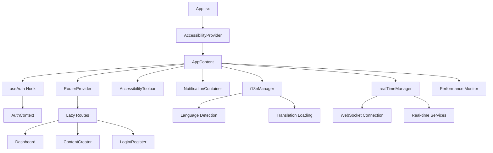
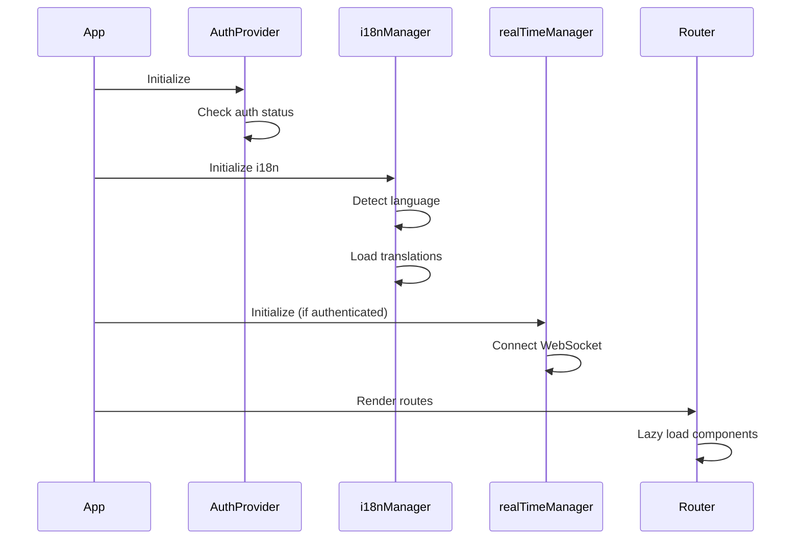
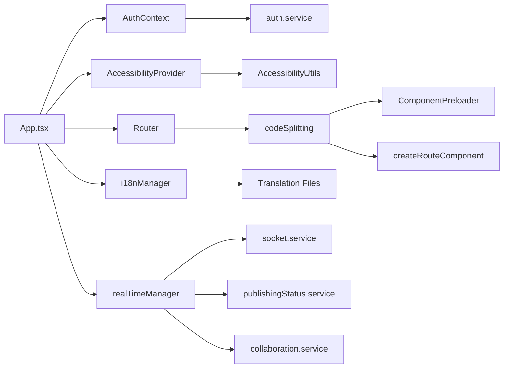

# Knowledge Documentation: App.tsx

## Overview

`src/App.tsx` is the main application entry point for the AI Content Automation frontend. It's a React TypeScript application built with modern React patterns, featuring comprehensive accessibility support, internationalization, real-time capabilities, and optimized SPA routing.

**Language**: TypeScript/React  
**Framework**: React 18 with React Router v6  
**UI Library**: Material-UI (MUI)  
**Architecture**: Single Page Application (SPA) with lazy loading and code splitting

## Implementation Details

### Core Structure

The App component follows a two-tier architecture:

1. **App** (Outer Component): Provides accessibility context wrapper
2. **AppContent** (Inner Component): Contains the main application logic and UI

```typescript
function App() {
  return (
    <AccessibilityProvider>
      <AppContent />
    </AccessibilityProvider>
  )
}
```

### Key Features

#### 1. **Router Configuration**
- Uses React Router v6 with `createBrowserRouter` for SPA optimization
- Implements future flags for better performance (`v7_normalizeFormMethod`)
- Comprehensive route structure with protected and public routes
- Lazy loading for all route components with custom loading states

#### 2. **Performance Optimization**
- **Code Splitting**: All routes use lazy loading via `createRouteComponent`
- **Component Preloading**: Critical components (Dashboard, ContentCreator, Login) are preloaded
- **Performance Monitoring**: Built-in performance measurement for app initialization
- **Bundle Optimization**: Strategic component preloading on idle time

#### 3. **Accessibility Integration**
- **AccessibilityProvider**: Wraps entire application for global accessibility settings
- **AccessibilityToolbar**: Fixed toolbar for font size, contrast, motion controls
- **Screen Reader Support**: Built-in screen reader compatibility
- **Keyboard Navigation**: Full keyboard navigation support
- **ARIA Compliance**: Proper ARIA attributes and roles

#### 4. **Internationalization (i18n)**
- **Dynamic Language Loading**: Async language switching with fallback
- **RTL Support**: Right-to-left language support (Arabic)
- **Locale Formatting**: Date, time, number, and currency formatting
- **Translation Management**: Comprehensive translation system with namespaces

#### 5. **Real-time Features**
- **RealTimeManager**: Centralized WebSocket management
- **User Context Integration**: Real-time services initialize with user authentication
- **Connection Management**: Automatic reconnection with retry logic
- **Service Integration**: Publishing status, live analytics, collaboration

#### 6. **Error Handling**
- **ErrorBoundary**: Global error boundary with custom error reporting
- **Graceful Degradation**: Fallback mechanisms for failed services
- **Development Debugging**: Conditional debug utilities in development mode

### Initialization Flow

1. **Accessibility Setup**: AccessibilityProvider initializes global accessibility settings
2. **Authentication Check**: useAuth hook checks user authentication status
3. **i18n Initialization**: Language detection and translation loading
4. **Performance Monitoring**: App initialization timing measurement
5. **Real-time Setup**: WebSocket connection when user is authenticated
6. **Router Rendering**: Main application routing with loading states

### State Management

- **Authentication**: Managed via AuthContext with useAuth hook
- **Accessibility**: Global accessibility settings via AccessibilityProvider
- **i18n**: Language state managed by i18nManager singleton
- **Real-time**: Connection state managed by realTimeManager singleton

## Dependencies

### Direct Dependencies
- `@mui/material` - UI component library
- `react` - Core React library
- `react-router-dom` - Client-side routing

### Internal Dependencies

#### Core Services
- `./hooks/useAuth` - Authentication state management
- `./router` - Route configuration and lazy loading
- `./utils/codeSplitting` - Component preloading and lazy loading utilities
- `./utils/performance` - Performance monitoring utilities
- `./utils/internationalization/i18nManager` - i18n management
- `./services/realtime.manager` - Real-time WebSocket management

#### UI Components
- `./components/common/AccessibilityUtils` - Accessibility provider and toolbar
- `./components/common/ErrorBoundaries` - Error boundary components
- `./components/common/LoadingStates` - Loading spinner components
- `./components/common/NotificationContainer` - Notification system

#### Development Utilities (DEV only)
- `./utils/login-test` - Development authentication testing
- `./utils/response-debug` - API response debugging

### External Dependencies
- **Material-UI**: Complete UI component system
- **React Router**: Advanced routing with lazy loading
- **Socket.IO**: Real-time communication (via realTimeManager)

## Visual Diagrams

### Application Architecture



### Initialization Sequence



### Dependency Graph



## Additional Insights

### Performance Considerations

1. **Lazy Loading Strategy**: All routes are lazy-loaded with skeleton loading states
2. **Component Preloading**: Critical components preloaded on idle time
3. **Bundle Splitting**: Strategic code splitting by routes and features
4. **Performance Monitoring**: Built-in timing for app initialization

### Security Features

1. **Protected Routes**: Authentication-required routes with proper guards
2. **Error Boundaries**: Prevents crashes from propagating
3. **Development Mode**: Debug utilities only loaded in development

### Accessibility Features

1. **WCAG Compliance**: Full accessibility toolbar with font, contrast, motion controls
2. **Screen Reader Support**: Proper ARIA attributes and live regions
3. **Keyboard Navigation**: Complete keyboard accessibility
4. **RTL Support**: Right-to-left language support

### Real-time Capabilities

1. **WebSocket Management**: Centralized real-time connection handling
2. **User Context**: Real-time features tied to user authentication
3. **Service Integration**: Publishing status, analytics, collaboration
4. **Connection Resilience**: Automatic reconnection with retry logic

### Internationalization

1. **Dynamic Loading**: Languages loaded on-demand
2. **Fallback System**: Graceful fallback to English if language fails
3. **Locale Formatting**: Proper date, time, number, currency formatting
4. **RTL Support**: Complete right-to-left language support

## Metadata

- **Analysis Date**: 2024-12-19
- **Analysis Depth**: Deep (3 levels of dependencies)
- **Files Analyzed**: 8 core files
- **Entry Point**: src/App.tsx
- **Dependencies Mapped**: 15+ internal modules, 3 external libraries

## Next Steps

### Recommended Follow-up Analysis

1. **Authentication Flow**: Analyze `src/contexts/AuthContext.tsx` and `src/services/auth.service.ts`
2. **Routing System**: Deep dive into `src/router/index.tsx` and route protection
3. **Real-time Services**: Examine `src/services/realtime.manager.ts` and related services
4. **Component Architecture**: Analyze key components like Dashboard and ContentCreator
5. **Performance Optimization**: Review `src/utils/codeSplitting.tsx` and performance utilities

### Potential Improvements

1. **Error Recovery**: Enhanced error recovery mechanisms
2. **Offline Support**: Service worker integration for offline functionality
3. **Analytics Integration**: Enhanced performance and user analytics
4. **Testing Coverage**: Comprehensive test suite for App component
5. **Documentation**: API documentation for custom hooks and utilities

### Related Knowledge Captures

- `src/router/index.tsx` - Routing configuration and lazy loading
- `src/contexts/AuthContext.tsx` - Authentication state management
- `src/services/realtime.manager.ts` - Real-time WebSocket management
- `src/utils/codeSplitting.tsx` - Performance optimization utilities
